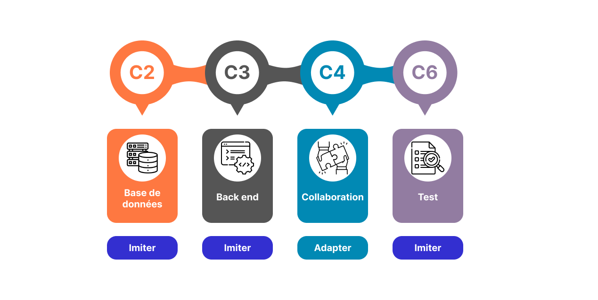

<!-- new slide -->

# Compétences Cibles

{:width="700px" }
*Compétences Cibles*

<!-- note -->

Ce lab cible les compétences suivantes:

- **C2 Base de données :** Manipuler une base de données - perfectionnement.
- **C3 Back end :** Développer la partie back-end d’une application web ou web mobile - perfectionnement.
- **C6 Test :** Préparer et exécuter les plans de tests d’une application.
