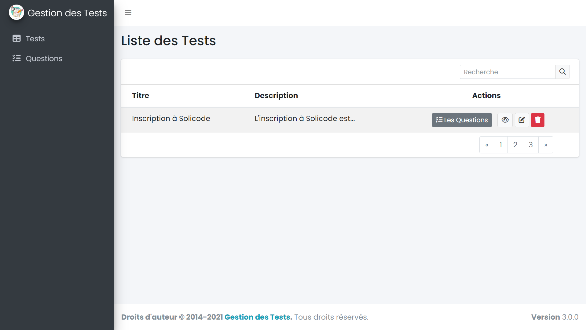
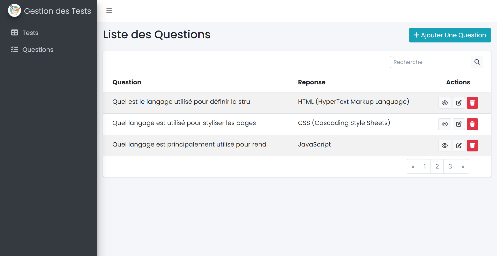
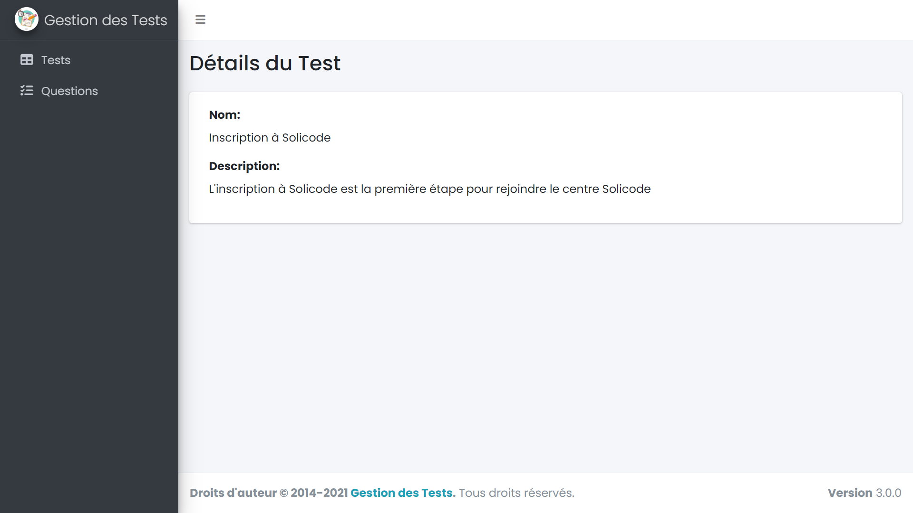
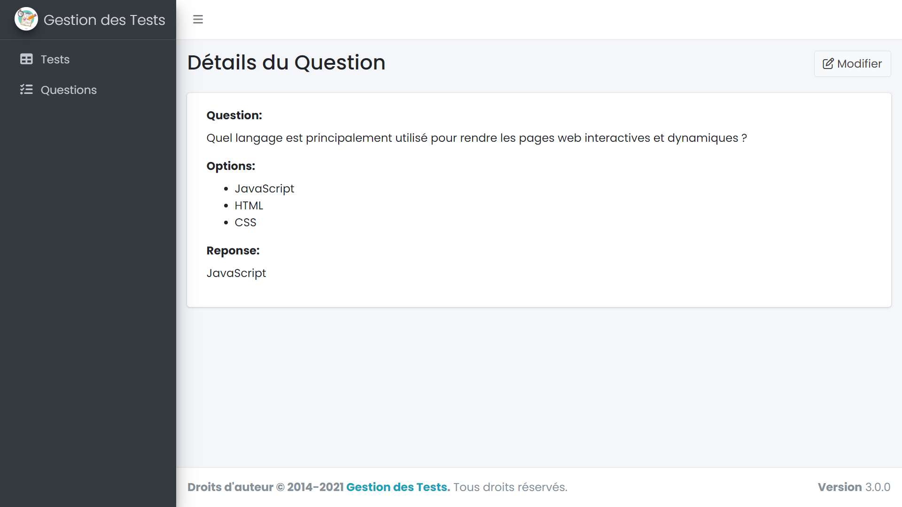
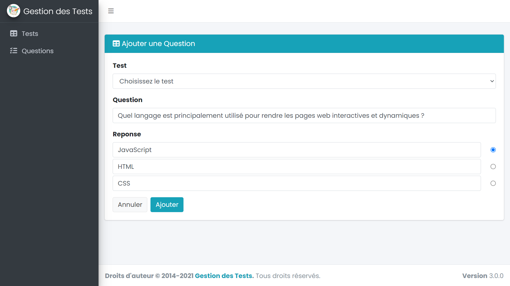

<!-- new slide -->

# Maquettes

<!-- new slide -->
## Page d'accueil

{:width="90%"}
*Page d'accueil*

<!-- new slide -->

## Page index des Questions

{:width="90%"}
*Page index des Questions*

<!-- new slide -->

## Page de détails du test

{:width="90%"}
*Page de détail du test*

<!-- new slide -->

## Page de détails de la question

{:width="90%"}
*Page de détail de la question*

<!-- new slide -->

## Page d'ajout d'une question

{:width="90%"}
*Page detail des Question*

<!-- new slide -->

## Les commande utiliser

```bash
npm install admin-lte@^3.2 --save
```
<!-- new slide -->
