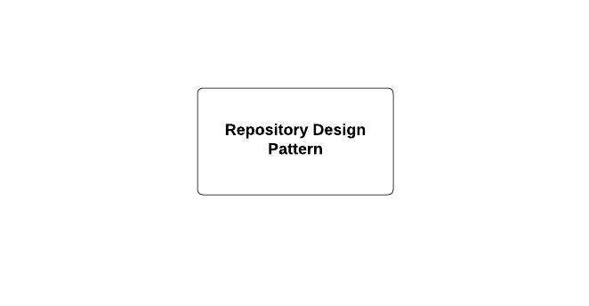

<!-- new slide -->

# Prérequis

<!-- note -->

Pour réaliser ce Lab, nous avons besoin des prérequis suivants:

<!-- new slide -->

## MVC

{:width="500px"}
*mvc*

<!-- note -->

Cela nécessite de savoir comment travailler avec le modèle de conception MVC.

<!-- new slide -->

## OOP
  
{:width="500px"}
*OOP*

<!-- note -->

Cela nécessite de connaître 4 principes de la POO.

<!-- new slide -->

## Repository Design Pattern

{:width="500px"}
*Repository Design Pattern*

<!-- note -->

Composer est un gestionnaire de dépendances pour PHP. Laravel utilise Composer pour gérer ses dépendances et ses packages. Assurez-vous d'avoir Composer installé sur votre système.

<!-- new slide -->

## Laravel Framework

{:width="500px"}
*Laravel*

<!-- note -->

Nous avons besoin d'un framework php comme laravel pour réaliser ce projet.

<!-- new slide -->

## Test unitaire

{:width="700px"}
*Test unitaire*

<!-- note -->

Pour réaliser ce lab, nous avons besoin de quelques connaissances en tests unitaires.
