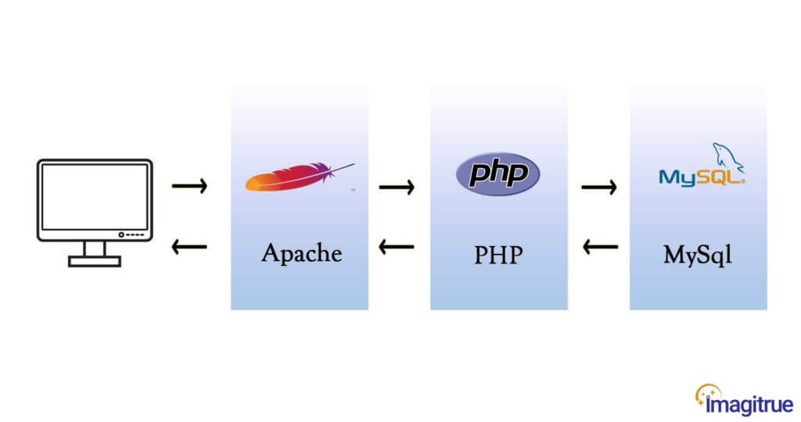

<!-- new slide -->
# Prérequis

<!-- note -->

Pour réaliser ce Lab, nous avons besoin des prérequis suivants:

<!-- new slide -->

## Les langues de programation

{:width="500px"}
*les langues de programation*

<!-- note -->

Vous devriez avoir des connaissances de base en développement web, y compris HTML, CSS, JavaScript et PHP, ainsi qu'une compréhension générale du modèle MVC (Modèle-Vue-Contrôleur) utilisé par Laravel.

<!-- new slide -->

## Environnement de développement local
  
{:width="500px"}
*Environnement*

<!-- note -->

Pour réaliser cette application, nous devons disposer d'un environnement de développement local configuré sur notre machine.
Cela inclura un serveur Web Apache, PHP et un SGBD comme MySQL.

<!-- new slide -->

## Composer

{:width="500px"}
*Composer*

<!-- note -->

Composer est un gestionnaire de dépendances pour PHP. Laravel utilise Composer pour gérer ses dépendances et ses packages. Assurez-vous d'avoir Composer installé sur votre système.

<!-- new slide -->

## Laravel Framework

{:width="500px"}
*Laravel*

<!-- note -->

Nous avons besoin d'un framework php comme laravel pour réaliser ce projet.

<!-- new slide -->

## AdminLTE

{:width="500px"}
*AdminLTE*

<!-- note -->

Nous devons télécharger AdminLTE dans notre projet Laravel depuis le site officiel d'Admin LTE, ce package servira d'interface utilisateur de notre projet.

<!-- new slide -->

## Test unitaire

{:width="700px"}
*Test unitaire*

<!-- note -->

Pour réaliser ce lab, nous avons besoin de quelques connaissances en tests unitaires.
